# Let's try it out - Provision Azure with Python using CDK for Terraform, cdktf

Written by: [Pasi "pahis" Huttunen](https://www.linkedin.com/in/pasihuttunen/) - 23.7.2020

Hashicorp has just published terraform-cdk - Cloud Development Kit for Terraform: https://github.com/hashicorp/terraform-cdk

```
The CDK for Terraform project helps users define infrastructure resources using supported programming languages and generates a Terraform configuration in JSON. Users can then use the Terraform or the CDK for Terraform CLI to deploy the application.
```

This is so cool! It allows us to write IaC, but by using the languages we are using in our daily project life without drifting away from the battle-proven Terraform.

The current version 0.0.12 is pretty early, so things are quite rough on the edges. I wanted to test whether it is mature enough to actually deploy resources to Azure using Python.

As an added challenge, cdktf currently doesn't have examples of how to use Python with Azure. Well, that doesn't stop me from figuring out!

Hopefully, you get both inspiration and help from these instructions.

## The short and the really long version

I think I am cursed. Every time I try to make a fast proof of concept, I end up battling with related and especially unrelated problems. Nothing ever works as instructed.

In this case, the missing instructions on how to use Python with Azure will make things even more challenging.

But that is okay! That is fun! Learning will ensue!

For these reasons, I've decided to split these instructions into two different versions:

[The short version](#short-version) gives the essential information.

[The really long version](#the-really-long-version) is more like a journal. It tells what I tried, what I failed, and what I eventually learned. If you have a bit more time, this is the more fun version of getting things up and running. You will probably also learn a bit more.


## SHORT VERSION

**STEP 1:** Prerequisities

These instructions assume that you have working Terraform Azure setup.

I'll be using VSCode and Python extension by Microsoft for autocomplete and pylint for linting.

Make sure you have installed:
- [Terraform](https://www.terraform.io/downloads.html) >= v0.12
- [Node.js](https://nodejs.org/) >= v12.16
- [Python](https://www.python.org/downloads/) >= v3.7
- [Pipenv](https://pipenv.pypa.io/en/latest/install/#installing-pipenv/)
- [Pyenv](https://github.com/pyenv/pyenv) <- this is missing from the official instructions, but you'll need it if you have Python 3.8.x installed

Install cdktf
```
$ npm install -g cdktf-cli
```

**STEP 2:** cdktf init

Initialize empty folder to be used with cdktf
```
$ cd myproject
$ cdktf init --template="python" --local
```

It will install `Python 3.7.7` with `pyenv`, install virtualenv with `pipenv`, create `Pipfile`, add cdktf dependency to and install it, by default generate AWS provider (we'll change that just in a bit) and create default configuration files and `main.py`.

**STEP 3:** Change provider to Azure

Modify cdktf.json and change the AWS provider to Azure. I'll be using quite a recent version of the Azure provider.
```JSON
"terraformProviders": ["azurerm@~> 2.19"],
```

Azure provider code must be generated, so run:
```
$ cdktf get
```

You should be able to find Azure provider generated code from `imports/azurerm`

**STEP 4:** Modify `main.py`

You are now ready to provision the Azure resources by editing the `main.py`.

Start by importing the mandatory Azurerm module.

```python
from imports.azurerm import AzurermProvider
```

For this proof of concept, we'll be creating a new resource group. So let's import one more module.

```python
from imports.azurerm import ResourceGroup
```

_TIP_: It really pays off to use autocomplete here. There are gazillion modules to import and with autocomplete you can see all of them and can search for the required ones. Read the long version to find out how I configured VSCode if you have problems to do so.

We are ready to set up the Azure provider.

```python
# Minimum initialization for AzurermProvider
AzurermProvider(self, "MyProvider", features=[{}])
```

Feel free to use the autocomplete to see what other arguments `AzurermProvider` takes if you want to experiment. 

And then let's create the Resource group with a minimal set of arguments. Again, feel free to use the autocomplete to see what kind of arguments you could supply.

```python
# Create new Resource Group in West Europe
ResourceGroup(self, "MyResourceGroup", 
              name="rg-terratest",
              location="West Europe")
```

**STEP 5:** Synth and deploy

Synth builds the Python code as Terraform JSON.

Let's synth the code
```
$ cdktf synth
```

If everything is ok, you should find your Terraform JSON from `cdkft.out`

Now you can deploy it either with `cdktf`
```
$ cdktf deploy
```

or with Terraform
```
$ cd cdktf.out
$ terraform plan
$ terraform apply
```

**DONE**

That's it!

Go to Azure Portal or use Azure CLI `az` to check that it really did create a new resource group.

Easy as peasy!

Feel free to read the really long version to learn more.

## THE REALLY LONG VERSION

Let's start with the CDK for Terraform instructions: https://github.com/hashicorp/terraform-cdk

It has nice examples, especially how to use Typescript and how to use AWS, but using Python with Azure is completely missing.

So we need to do some serious digging to get the Python for Azure up and running.

Thankfully, there are generic instructions for Python, so let's start there: https://github.com/hashicorp/terraform-cdk/blob/master/docs/getting-started/python.md

### Prerequisities

**STEP 1:** As stated on Terraform CDK Python instructions, you need to have the following tools installed:
- [Terraform](https://www.terraform.io/downloads.html) >= v0.12
- [Node.js](https://nodejs.org/) >= v12.16
- [Python](https://www.python.org/downloads/) >= v3.7
- [Pipenv](https://pipenv.pypa.io/en/latest/install/#installing-pipenv/)

**STEP 2:** Install CDK for Terraform
```
$ npm install -g cdktf-cli
```

**STEP 3:** To make your life HELLA LOTS easier, install proper editor and linter.

In this journal, we'll be using
- [VSCode](https://code.visualstudio.com/download)
- [VSCode Python extension by Microsoft](https://marketplace.visualstudio.com/items?itemName=ms-python.python)

**STEP 4:** Make sure you have working Terraform configuration

This instruction assumes that you have already Terraform up and running and you should be able to run `terraform plan` and `terrafrom apply` successfully to your Azure subscription.

If not, Microsoft's tutorial is a good way to start: https://docs.microsoft.com/en-us/azure/developer/terraform/create-linux-virtual-machine-with-infrastructure

### cdktf init - initialize your project

Let's get started! By following the example of CDK for Terraform Python instructions, create a new folder and initialize it

**STEP 5**: Create a new folder and run `cdktf init`

```
$ mkdir cdktf-python-azure
$ cd cdktf-python-azure
$ cdktf init --template="python" --local
```

**PROBLEM**: Initialization fails, as I don't have Python 3.7.7 nor `pyenv` installed

I had Python 3.8.4, but CDK for Terraform wants to use Python 3.7.7. Initialization tries to install the required version, but it fails as I didn't have `pyenv` installed.

**SOLUTION**: So it seems that the instructions are missing one prerequisite: `pyenv`

Go ahead and install [pynev](https://github.com/pyenv/pyenv) now.

Things that didn't work:
- I tried to solve this by modifying `Pipfile` and change the required Python version. It didn't work, as you can't run `cdktf init` on a non-empty folder and by failing to run the init will cause required packages not to be loaded

**STEP 6**: Let's try again
```
$ cd ..
$ rm -rf cdktf-python-azure
$ mkdir cdktf-python-azure
$ cd cdktf-python-azure
$ cdktf init --template="python" --local
```

It works!

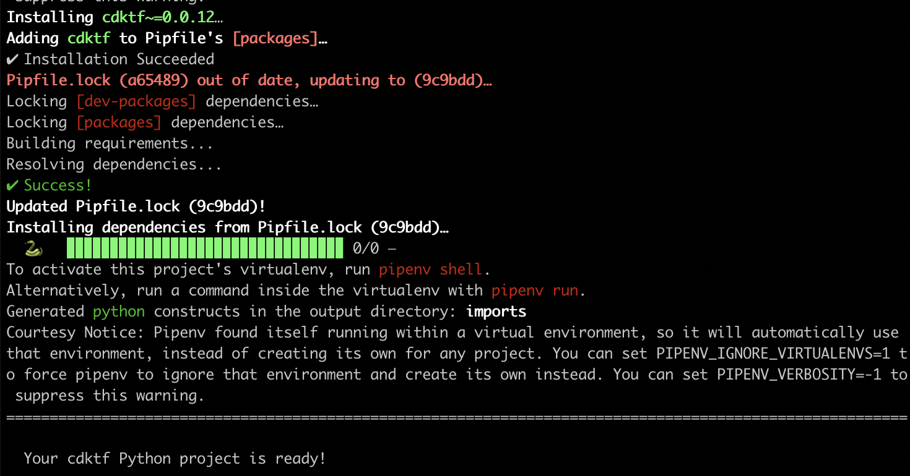

Things that happened
- Python virtualenv installed (run `pipenv --py` to check that out)
- Pipfile created
- Package cdktf 0.0.12 dependency added to Pipfile and installed, thus creating Pipfile.lock
- `cdktf.json` created with default provider AWS (don't worry, we'll change that soon)
- AWS provider Python module generated and dumped to `imports/aws`
- `main.py` file created - this is where the magic will happen

**STEP 7**: Configure VSCode

This is an optional step, as you can use whatever editor you want.

However, believe me, I tell you, you WILL need the help of proper productivity tools like linting and autocomplete, as the Azure provider has gazillion classes and the required parameters are not that clear.

Let's open the VSCode and ensure that everything is working

```
$ code .
```

Select correct Python interpreter
- Open command palette -> Python: Select interpreter
- Select the one which says `('cdktf-python-azure: pipenv')`
- You should see the correct version in the bottom of VSCode

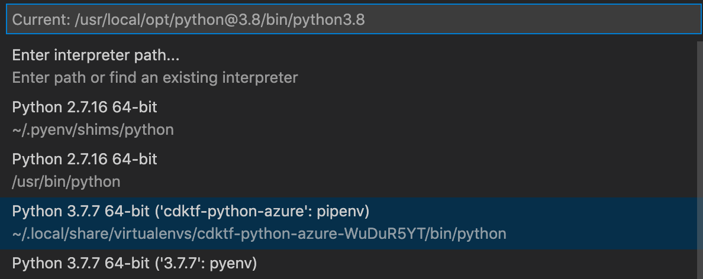

Ensure you can run Hello World from VSCode terminal.

Open main.py, add
```python
print("hello world!")
```

after the comment of `# define resources here`

Open VSCode terminal and ensure that you are in the project folder

Run
```
$ pipenv run ./main.py
```

You should see `hello world!`

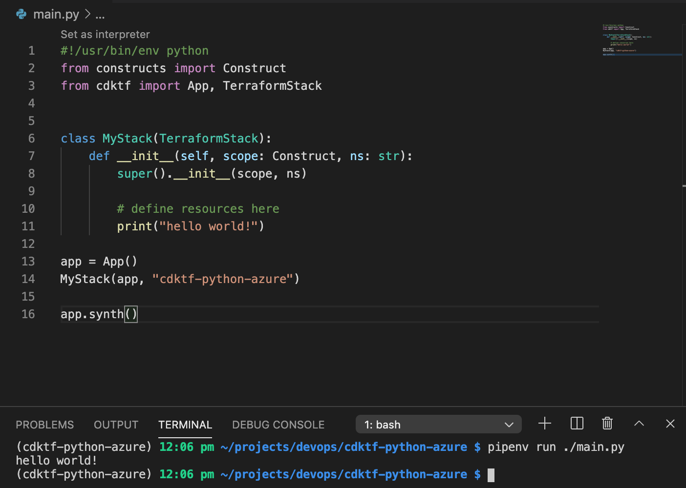

Install linter
- If VSCode asks to install `pylint`, do so
- If not, in the VSCode terminal write following
```
$ pipenv install pylint --dev
```

The rest of the commands for this journal are run in VSCode terminal.

**STEP 8**: Load Azure provider

Let's change the default AWS provider to Azure provider. This happens by modifying the `cdktf.json`

The magic happens in the line _"terraformProviders"_, we'll be using quite recent Azure provider version 2.19

```json
{
  "language": "python",
  "app": "pipenv run ./main.py",
  "terraformProviders": ["azurerm@~> 2.19"],
  "codeMakerOutput": "imports"
}
```

To be able to use the new provider, save the file and in the VSCode terminal run

```
$ cdktf get
```

After waiting for a while, the Azure provider code should be generated to the folder: `imports/azurerm`

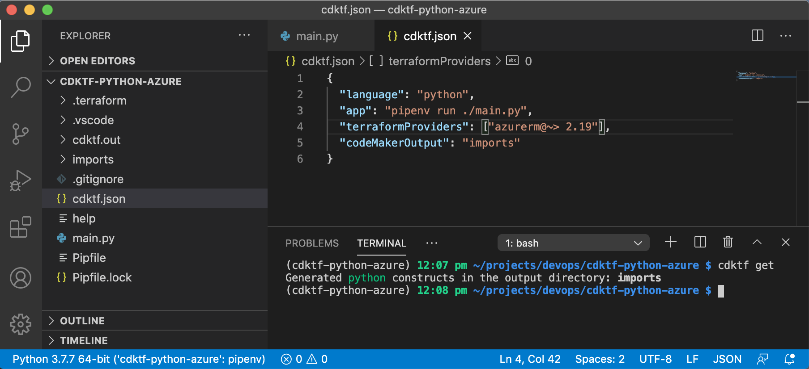

**STEP 9:** Import Azure Provider module

For all the resources you'll need, you need to import the matching class from the generated Azure provider.

Start by importing the `AzurermProvider`, as that is mandatory to get stuff up and running.

Modify `main.py` and add the following line to the imports:
```python
from imports.azurerm import AzurermProvider
```

**STEP 10:** Import ResourceGroup and enjoy the autocomplete

To make this proof of concept simple, we will only set up a new resource group.

Start by importing the ResourceGroup resource.

Modify `main.py` and add the following line to the imports:
```python
from imports.azurerm import ResourceGroup
```

But how do I know which resources to import?

Autocomplete to the rescue!

Try it out:
- from imports.azurerm import Res (_press ctrl+space_)
- VOILA! Autocomplete gives you all the resources there are in the generated Azure provider.

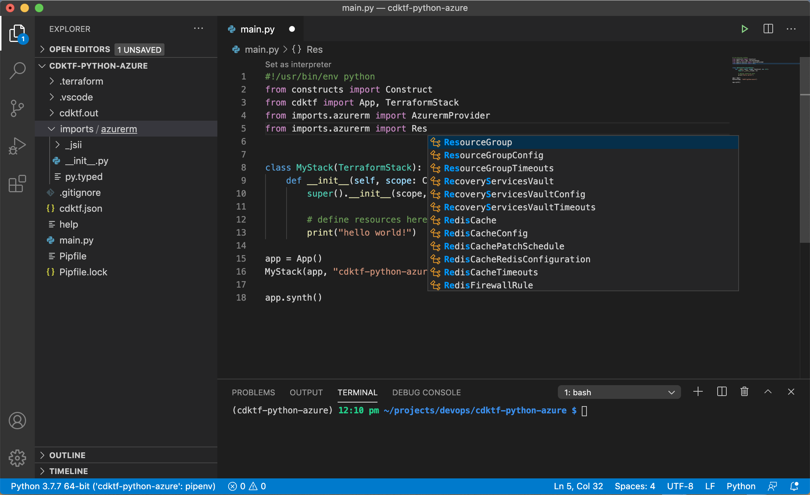

This is exactly why I asked you to install proper tooling! Noooooice!

**STEP 11:** Setup Azure provider

One more mandatory step. The Azure provider has to be initialized. Let's see how that works.

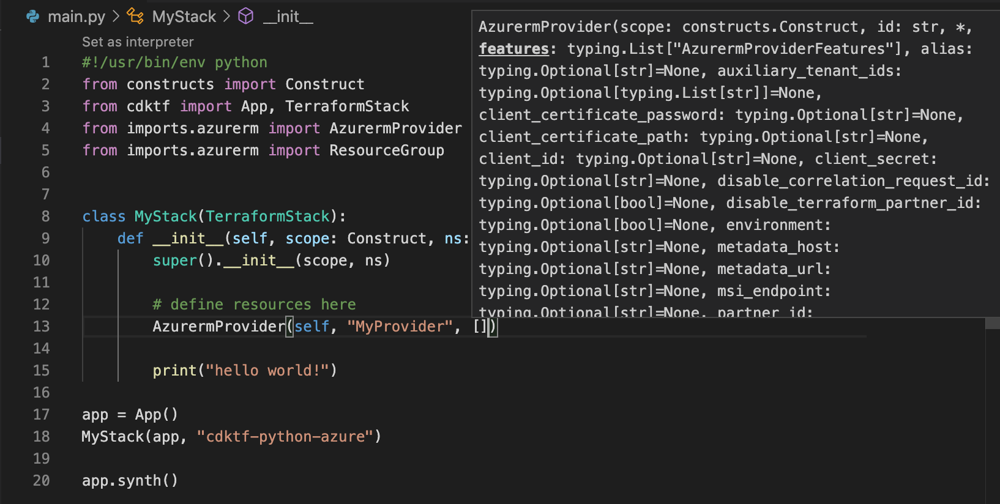

Thanks to the magic of the autocomplete, we see that it requires some mandatory arguments.

The first argument is `self`, then give the name of the resource (notice: this is not an Azure name, but Terraform name) and it seems to also need a list of features.

We don't need features, so we can leave it as an empty list.

So we ended up modifying main.py and adding this line of code
```python
AzurermProvider(self, "MyProvider", [])
```

Let's check if this works

```
$ pipenv run ./main.py
```

Well, it did not.

The error shown in the terminal is a bit cryptic

```
TypeError: __init__() takes 3 positional arguments but 4 were given
```

Thanks to the magic of the linter we installed, `pylint`, the real problem is easy to pinpoint.

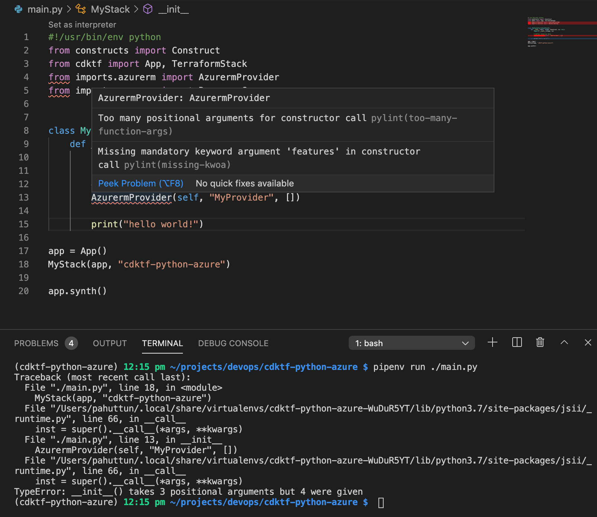

Ach so! So the list of Azure provider features should be given with a keyword instead of a positional argument.

Fix the line you just added to look like this:

```python
AzurermProvider(self, "MyProvider", features=[])
```

Ready to try again

```
$ pipenv run ./main.py
```

Yay, it works!

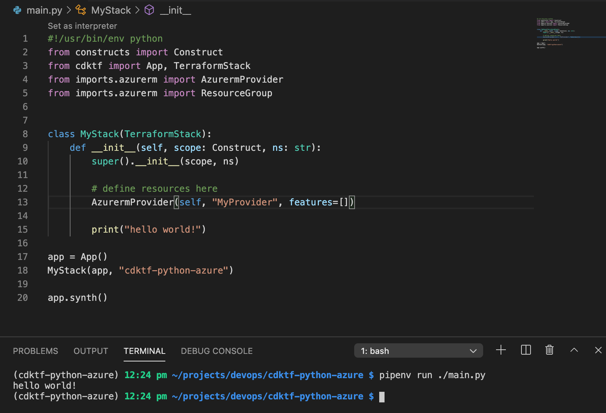

NOOIIIIICE!!!!!

_(actually there is still a bug, but more of that a bit later)_

**STEP 12:** Add ResourceGroup

Let's go ahead and configure the resource group we want to provision.

We can use the autocomplete to see what arguments we need to provide and how.

This is so cool! Makes life so much easier!

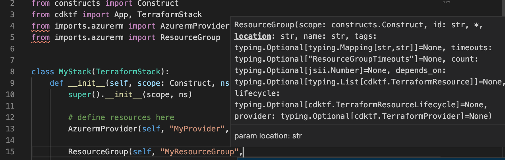

Okay, so let's give the scope as self, Terraform name for our resource group, and then it seems to request location and name.

Had to google a bit in which format to give the location, but use the long version. We'll be using `"West Europe"` here.

The last mandatory argument, name, is the Azure name of the resource. We'll use `"rg-terratest"`.

So your code should look like this

```python
ResourceGroup(self, "MyResourceGroup", location="West Europe", name="rg-terratest")
```

Let's run our beloved hello world to check if we are on the right track.

```
$ pipenv run ./main.py
```

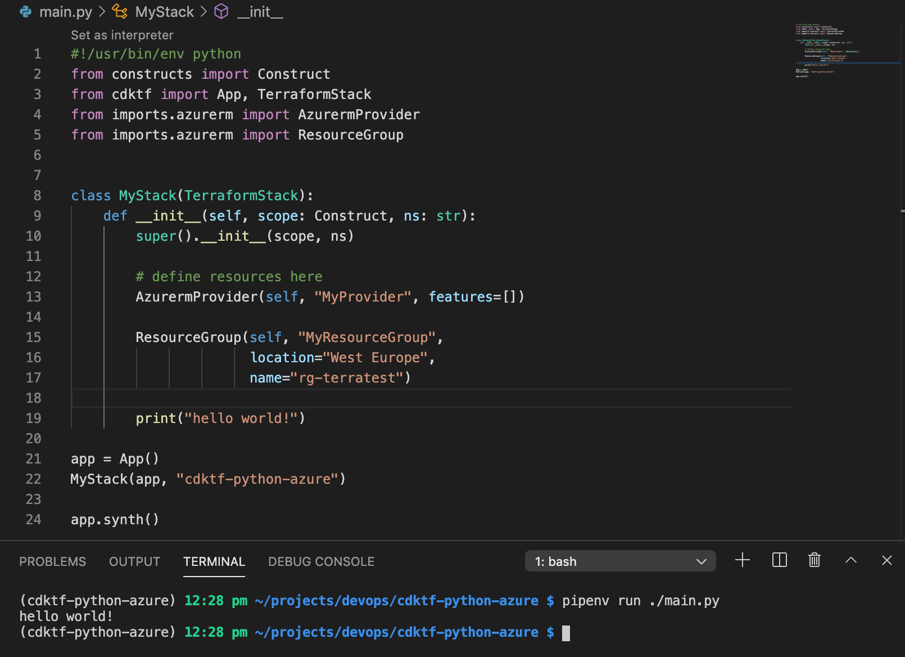

Protip: "`VSCode Autocomplete` - `pylint` - `pipenv run ./main.py`" trinity saved me hours of headache! Argument by argument you can quite easily find out what is the required format and whether you got it right, as things are not that super clear.

**STEP 13:** Let's deploy all the things!

We are ready to deploy our stuff to the Azure. Aw yiss!!!

The workflow is the following:
- Synthesize the code (=build it as Terraform JSON)
- Deploy it via either cdktf or terraform

Let's synth it out!

```
$ cdktf synth
```

IT WORKS!

Okay, let's deploy all the things!

```
$ cdktf deploy
```

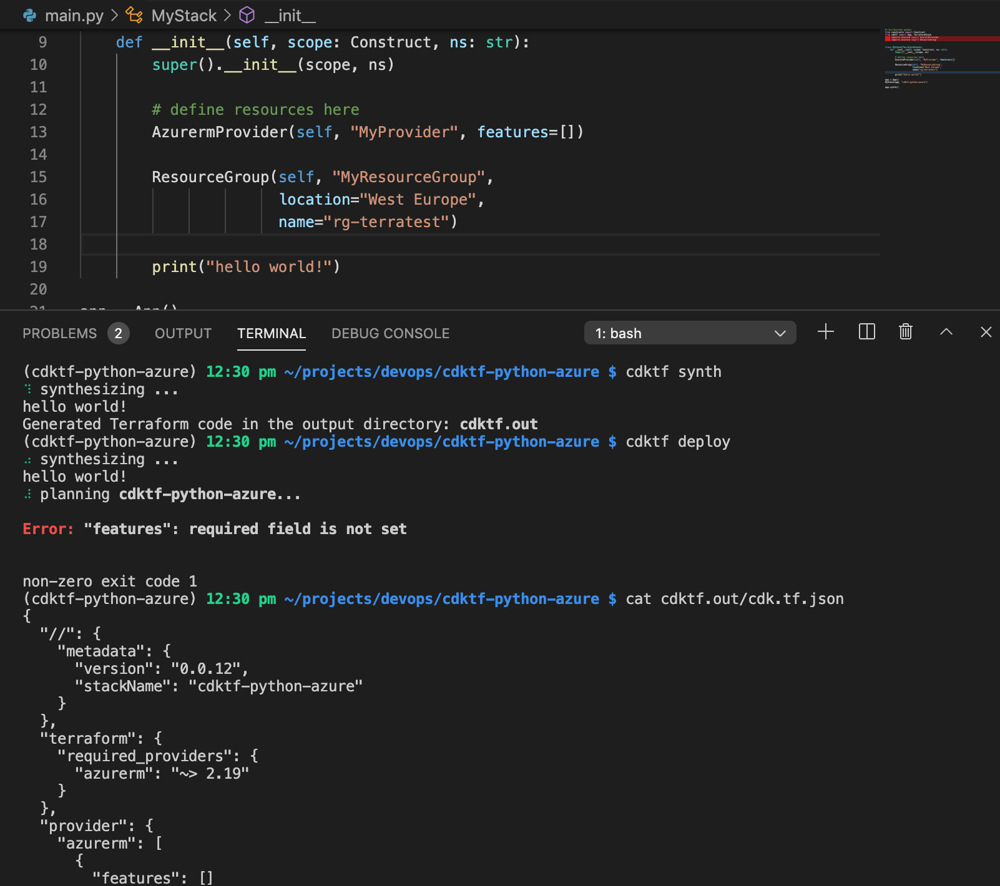

Qe?

Not a surprise that it didn't work. But why it didn't work?

It seems to complain that we are missing `features`, but I am pretty sure that I included the keyword and empty list.

This caused some serious head-scratching until I found the error. Stupid mistake, but I had set the features to be empty list, but it requires to be an empty JSON object.

Debugging protip: `cdktf synth` outputs Terraform JSON to `cdktf.out/cdk.tf.json`. As you can see from the screenshot above, the line of `"features": []` is wrong. It should be `"features": {}"`. This was quite easy to spot after I compared the JSON with my other Terraform test project written with pure terra.

Okay, let's fix the problem. Change the Azure provider line to be following

```python
AzurermProvider(self, "MyProvider", features=[{}])
```

**STEP 14:** Let's deploy all the things, again!

```
$ cdktf synth
$ cdktf deploy
```

IT WORKS! OMG YEAH! AW YISS! SWEET AZURE RESOURCES!

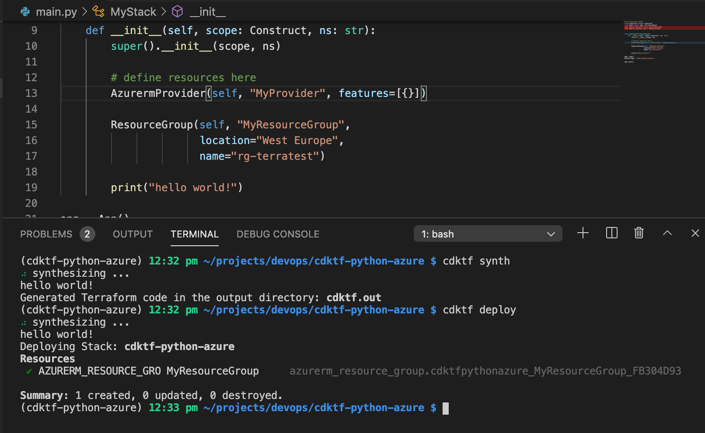

**STEP 15:** Prove that it works

Let's ensure that actually, everything did work as required.

Open your Azure portal and check the resource groups after giving it a moment to be provisioned.

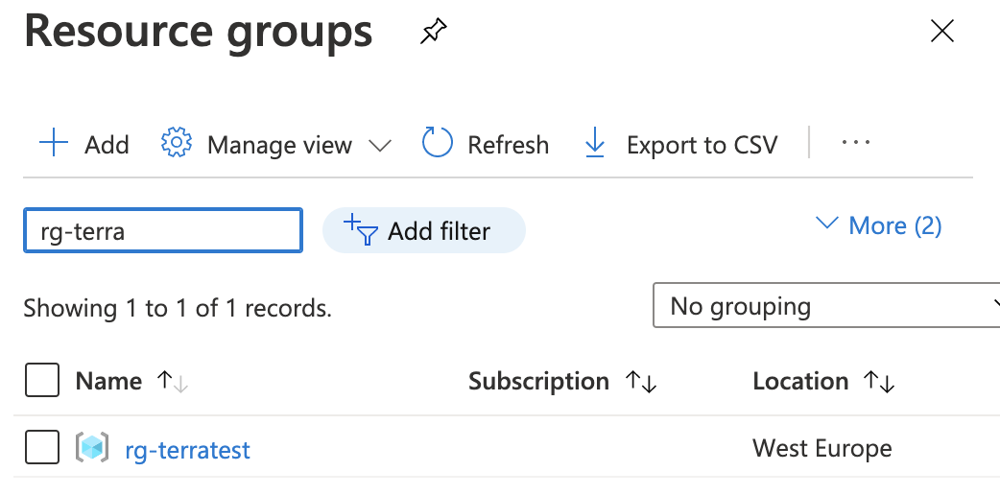

There it is!

Easy like eating a pie!

Thank you for following my exciting journey with the CDK for Terraform, Python, and Azure.

Pahis out!

*mic drop*

If you have any comments, feel free to drop a line in the [Linkedin](https://www.linkedin.com/in/pasihuttunen/).